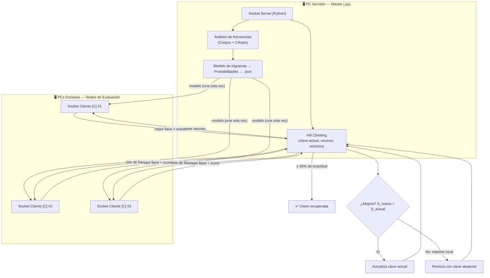

# 🔐 Criptoanálisis Estadístico Distribuido


Sistema distribuido de alto rendimiento para romper **cifrados de sustitución monoalfabética** de forma automatizada. Apoyándose en la teoría de la información, explota la redundancia estadística del idioma español (modelo de trigramas) para recuperar el texto claro **sin conocer la clave de cifrado**.

La carga se reparte estratégicamente: un **Orquestador en Python** concentra la lógica de control y la búsqueda heurística (*Hill Climbing*), mientras que varios **Nodos de Evaluación en C** funcionan como motores de cálculo puro, evaluando cientos de miles de claves por segundo.

---

## 📑 Contenido

1. [Tecnologías y herramientas](#-tecnologías-y-herramientas)
2. [Arquitectura del sistema](#️-arquitectura-del-sistema)
3. [Fundamento matemático](#-fundamento-matemático)
4. [Algoritmo de búsqueda (Hill Climbing)](#-algoritmo-de-búsqueda-hill-climbing)
5. [Flujo del nodo cliente en C](#-flujo-del-nodo-cliente-en-c)
6. [Protocolo de comunicación](#-protocolo-de-comunicación-propuesta)
7. [Estructura del repositorio](#-estructura-del-repositorio-propuesta)
8. [Instalación y uso](#-instalación-y-uso)
9. [Pruebas experimentales](#-pruebas-experimentales)
10. [Consideraciones de diseño](#-consideraciones-de-diseño)

---

## 🧰 Tecnologías y herramientas

| Componente | Tecnología | Uso en el proyecto |
|---|---|---|
| Orquestador (Master) | **Python 3.x** | Normalización del corpus, modelo de trigramas, Hill Climbing, servidor de sockets |
| Nodos de evaluación | **C (C99/C11)** | Descifrado con LUT y cálculo del score a máxima velocidad |
| Compilador | **GCC / Clang** (`-O3 -lm`) | Optimización y enlace de la librería matemática |
| Comunicación | **Sockets TCP/IP (POSIX)** | Envío de lotes de claves y recepción de resultados |
| Intercambio del modelo | **JSON** o volcado binario | Transporte de las 17,576 probabilidades de trigramas |
| Librerías Python | `socket`, `threading`/`selectors`, `json`, `math`, `collections`, `random`, `unicodedata` | Red, concurrencia, estadística y normalización |
| Gráficas y reporte | `matplotlib`, `pandas` *(opcional)* | Longitud vs. exactitud, tiempo, reinicios, etc. |
| Sistema operativo | **Linux/Unix** (recomendado) | Sockets POSIX nativos |
| Datos | **Corpus en español** (texto plano) | Entrenamiento del modelo estadístico |

---

## ⚙️ Arquitectura del sistema

Modelo **maestro/esclavo** con procesamiento por lotes (*chunking*) para maximizar el uso de CPU y minimizar la latencia de red.



### 🐍 Orquestador / Master (Python)
- **Normalización del corpus:** mayúsculas A–Z, sin espacios, acentos ni puntuación.
- **Generador del modelo:** extrae frecuencias de trigramas y calcula sus probabilidades.
- **Hill Climbing:** mantiene el *estado* de la búsqueda, genera claves aleatorias iniciales y lotes de **claves vecinas** (intercambio de exactamente 2 posiciones de la permutación del alfabeto).
- **Despacho distribuido:** servidor de sockets TCP que envía lotes masivos de claves.
- **Evaluación global:** recibe la mejor clave de cada cliente, compara scores y decide si **actualiza** la clave actual o **reinicia** al detectar un máximo local.

### ⚡ Nodos de Evaluación / Esclavos (C)
- **Motores "tontos" pero muy rápidos:** no deciden cuándo termina el ataque; solo puntúan lotes y devuelven el máximo local del lote.
- **Precarga en RAM:** texto cifrado y modelo de trigramas en memoria antes de evaluar (cero I/O en el bucle).
- **Descifrado O(1) por carácter** mediante Tabla de Búsqueda (LUT) ASCII de 256 posiciones.
- **Restricciones de rendimiento:** sin `malloc` dentro de los ciclos de evaluación, mínimas sentencias `if` (mejor *branch prediction*) y logaritmos **precalculados** en la inicialización.

---

## 🧮 Fundamento matemático

El criptoanálisis no busca palabras en un diccionario: cuantifica qué tan compatible es el texto candidato con la estructura estadística del idioma.

1. **Redundancia y trigramas.** El lenguaje natural es redundante: las letras previas reducen la incertidumbre de las siguientes. Se modela con ventanas deslizantes de tres letras.
2. **Función de puntuación.** Para evitar *underflow* al multiplicar probabilidades diminutas, se suma la cantidad de información (logaritmos base 2):

$$S(T) = \sum_{i=1}^{N-2} \log_2 P(t_i\, t_{i+1}\, t_{i+2})$$

3. **Suavizado.** Si un trigrama no existe en el corpus, se evita $\log_2(0)$ asignando una probabilidad mínima:

$$P_{min} = \frac{1}{10B}$$

   donde $B$ es el total de trigramas del corpus.

4. **Espacio del modelo.** Arreglo estático de $26^3 = 17{,}576$ elementos (`float`/`double`) con el $\log_2 P$ de cada combinación de `AAA` a `ZZZ`.

---

## 🧗 Algoritmo de búsqueda (Hill Climbing)

```text
1. clave_actual ← permutación aleatoria del alfabeto
2. score_actual ← S(descifrar(cifrado, clave_actual))
3. Repetir:
     a. Generar lote de vecinos (swap de 2 posiciones) y repartirlo entre los nodos
     b. Cada nodo devuelve (mejor_clave_del_lote, mejor_score_del_lote)
     c. mejor ← máximo entre las respuestas de todos los nodos
     d. Si mejor.score > score_actual → clave_actual ← mejor.clave        (ascenso)
        Si no                         → máximo local → REINICIO (paso 1)
4. Terminar al alcanzar el criterio de éxito o un límite de reinicios/iteraciones
```

---

## 🔧 Flujo del nodo cliente en C

**Fase 1 — Inicialización (una sola vez)**
1. Cargar el texto cifrado normalizado en un buffer en RAM.
2. Recibir el modelo de trigramas desde Python (`.json` o volcado binario de 17,576 probabilidades).
3. Precalcular logaritmos: si `P = 0` aplicar `P_min`; guardar `log2(P)` en `arreglo_prob_log[17576]`.
4. Conectar el socket al Master.

**Fase 2 — Bucle de trabajo (CPU bound)**
1. **Recibir lote** con $N$ claves vecinas.
2. Para cada clave `k`:
   - Construir la **LUT ASCII** (256 posiciones) con la clave de 26 caracteres.
   - **Descifrar** el texto con la LUT en un buffer temporal preasignado.
   - **Puntuar** con ventana deslizante de 3 en 3:
     ```c
     idx = (c1 - 'A') * 676 + (c2 - 'A') * 26 + (c3 - 'A');
     score_actual += arreglo_prob_log[idx];
     ```
   - **Filtrar:** conservar solo la clave con el score más alto del lote.
3. **Retornar** la mejor clave y su score al Master y repetir.

---

## 📡 Protocolo de comunicación (propuesta)

| Sentido | Mensaje | Contenido |
|---|---|---|
| Master → Cliente | `MODEL` | 17,576 probabilidades (JSON o binario) |
| Master → Cliente | `CIPHER` | Texto cifrado normalizado |
| Master → Cliente | `BATCH` | $N$ claves de 26 caracteres |
| Cliente → Master | `RESULT` | Mejor clave del lote + score |
| Master → Cliente | `STOP` | Fin del ataque |

> Se recomienda un encabezado de longitud fija (tipo + tamaño) para delimitar mensajes sobre TCP.

---

## 📁 Estructura del repositorio (propuesta)

```text
.
├── master/
│   ├── master.py          # Servidor de sockets + Hill Climbing
│   ├── modelo.py          # Normalización del corpus y modelo de trigramas
│   └── experimentos.py    # Ejecución de pruebas y métricas
├── esclavo/
│   └── esclavo.c          # Nodo de evaluación
├── data/
│   ├── corpus_es.txt      # Corpus de entrenamiento
│   ├── modelo.json        # Probabilidades de trigramas (generado)
│   └── criptogramas/      # Textos cifrados (N = 25, 50, 100, 200, 500)
├── resultados/            # CSV y gráficas
└── README.md
```

---

## 🚀 Instalación y uso

### Prerrequisitos
- Python 3.x
- GCC o Clang
- Linux/Unix (recomendado, sockets POSIX)
- Red local entre el Master y los nodos (mismo puerto abierto)

### 1. Compilar el nodo esclavo (C)
Se enlaza la librería matemática (`-lm`) por el uso de `log2`.
```bash
gcc esclavo/esclavo.c -o esclavo -lm -O3
```

### 2. Generar el modelo de trigramas (Python)
```bash
python3 master/modelo.py --corpus data/corpus_es.txt --salida data/modelo.json
```

### 3. Iniciar el Master
```bash
python3 master/master.py --cifrado data/criptogramas/cifrado_100.txt --puerto 5000 --nodos 3
```

### 4. Conectar los nodos esclavos (en cada PC)
```bash
./esclavo <IP_DEL_MASTER> 5000
```

> Los nombres de archivos y parámetros son orientativos; ajústalos a tu implementación.

---

## 📊 Pruebas experimentales

- **Longitudes de criptograma:** $N = 25, 50, 100, 200, 500$.
- **Métricas por prueba:** iteraciones, reinicios (*restarts*), tiempo de ejecución, score obtenido y porcentaje de exactitud de caracteres descifrados.
- **Criterio de éxito:** recuperar correctamente **al menos el 95 %** del mensaje original.
- **Gráficas sugeridas:** Longitud vs. Exactitud, Longitud vs. Tiempo, Longitud vs. Reinicios, y escalabilidad (1, 2 y 3 nodos).

---

## 📝 Consideraciones de diseño

- **El 95 % es un criterio de éxito, no un umbral de score.** La exactitud se mide comparando contra el texto claro conocido durante las pruebas; los nodos nunca lo evalúan. La decisión de terminar o reiniciar es siempre del Master.
- **Los nodos solo devuelven el máximo local de su lote**, lo que reduce el tráfico de red y mantiene la lógica heurística centralizada.
- **Textos cortos (N = 25–50)** tienen poca redundancia estadística; se espera menor exactitud y más reinicios.
- **Rendimiento:** el cuello de botella debe ser CPU, no red; por eso se envían lotes grandes y se precalcula todo lo posible.

---

## 🎓 Contexto académico

Proyecto desarrollado a partir del material de la Sesión 06 — *Criptoanálisis estadístico*, aplicando conceptos de teoría de la información (redundancia, entropía y cantidad de información).
