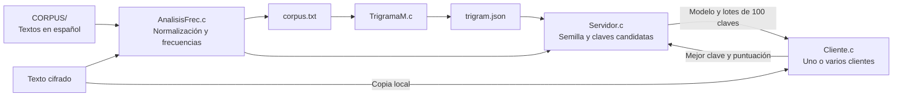

# 🔐 Criptoanálisis estadístico distribuido


Proyecto en **C** para explorar el criptoanálisis de cifrados de sustitución monoalfabética mediante análisis de frecuencias y un modelo de trigramas del español. Un servidor genera claves candidatas y distribuye su evaluación entre clientes conectados por **TCP/IPv4**.

## 📑 Contenido

- [Estructura del repositorio](#estructura-del-repositorio)
- [Funcionamiento](#funcionamiento)
- [Modelo estadístico](#modelo-estadístico)
- [Requisitos](#requisitos)
- [Compilación](#compilación)
- [Ejecución](#ejecución)
- [Protocolo de comunicación implementado](#protocolo-de-comunicación-implementado)
- [Limitaciones actuales](#limitaciones-actuales)

---

<a id="estructura-del-repositorio"></a>

## 📁 Estructura del repositorio

```text
criptoanalisis-estadistico/
├── AnalisisFrec.c
├── AnalisisFrec.h
├── Cliente.c
├── Servidor.c
├── TrigramaM.c
├── TrigramaM.h
├── CORPUS/
│   ├── doñaPerfecta.txt
│   ├── doñaPerfecta.txt:Zone.Identifier
│   ├── laFamiliaDeLeonRoch.txt
│   ├── laFamiliaDeLeonRoch.txt:Zone.Identifier
│   ├── loProhibido.txt
│   └── loProhibido.txt:Zone.Identifier
├── marianela(CIFRAR).txt
├── marianelaCIFRADO.txt
└── README.md
```

| Archivo o directorio | Función |
|---|---|
| `Servidor.c` | Escucha conexiones, prepara el modelo, genera lotes de claves, recibe resultados y conserva la mejor clave encontrada. |
| `Cliente.c` | Carga el cifrado local, recibe el modelo, evalúa las claves y devuelve la mejor de cada lote con su puntuación. |
| `AnalisisFrec.c` | Cuenta las letras del cifrado, genera una semilla ordenada por frecuencia y construye `corpus.txt`. |
| `AnalisisFrec.h` | Declara la función `analisisFrecuencias`. |
| `TrigramaM.c` | Calcula las probabilidades de trigramas del corpus y escribe `trigram.json`. |
| `TrigramaM.h` | Declara la función `trigrama_main`. |
| `CORPUS/` | Contiene los textos de referencia para construir el modelo del español. |
| `marianela(CIFRAR).txt` | Texto de referencia para el cifrado. |
| `marianelaCIFRADO.txt` | Archivo cifrado que el servidor usa para calcular la semilla inicial. |
| `*:Zone.Identifier` | Archivos auxiliares de metadatos de descarga de Windows. |

El servidor procesa **todos los archivos regulares** directamente dentro de `CORPUS/`, incluidos los archivos `Zone.Identifier`. Conviene retirar esos metadatos de la carpeta usada para entrenar el modelo.

### Archivos generados

Al ejecutar el servidor se crean en el directorio de trabajo:

- `corpus.txt`: textos del corpus concatenados y normalizados a letras A–Z.
- `trigram.json`: probabilidades de los trigramas observados.

Los ejecutables `servidor` y `cliente` se crean al compilar.

<a id="funcionamiento"></a>

## ⚙️ Funcionamiento



1. El servidor cuenta las frecuencias de las letras de `marianelaCIFRADO.txt` y obtiene una semilla de 26 letras.
2. Normaliza los textos de `CORPUS/`: convierte minúsculas a mayúsculas, vocales acentuadas a su equivalente ASCII, Ü a U y Ñ a N; descarta los demás caracteres.
3. Genera el modelo de trigramas y acepta clientes.
4. Cada cliente recibe el modelo y confirma su recepción.
5. Al presionar **Enter en la terminal del servidor**, termina la fase de aceptación y comienza la distribución de trabajo.
6. El servidor envía lotes de **100 claves**, cada una de 26 letras.
7. Los clientes aplican cada clave al cifrado y puntúan el texto resultante.
8. Cada cliente devuelve la mejor clave de su lote y su puntuación. El servidor actualiza la mejor solución cuando recibe una mejora y continúa enviando trabajo.

Las claves vecinas se generan intercambiando dos posiciones de la semilla. La implementación actual no incorpora reinicios aleatorios al quedar atrapada en un máximo local.

<a id="modelo-estadístico"></a>

## 📊 Modelo estadístico

El cliente usa una tabla de **26³ = 17 576** combinaciones posibles de tres letras. Para un texto candidato de longitud N, calcula:

```text
score = suma de log2(P(trigrama_i)), para i = 0 ... N - 3
```

Una puntuación mayor indica mayor compatibilidad con el modelo. Los logaritmos se precalculan al cargarlo y los trigramas ausentes reciben una probabilidad mínima para evitar `log2(0)`.

El cliente transforma la suma en una puntuación porcentual usando referencias basadas en la entropía del modelo y la probabilidad mínima.

> [!IMPORTANT]
> La puntuación indica compatibilidad con el modelo. **No representa el porcentaje de caracteres correctamente descifrados.**

<a id="requisitos"></a>

## 🧰 Requisitos

- Linux con sockets POSIX.
- GCC compatible con C11.
- Git para clonar el repositorio.
- Biblioteca matemática estándar, enlazada con `-lm` al compilar el cliente.
- Conectividad TCP al puerto **6767** si los clientes se ejecutan en otras máquinas.

<a id="compilación"></a>

## 🔨 Compilación

```bash
git clone https://github.com/western1258/criptoanalisis-estadistico.git
cd criptoanalisis-estadistico

gcc -std=c11 -O3 Servidor.c AnalisisFrec.c TrigramaM.c -o servidor
gcc Cliente.c -o cliente -Wall -Wextra -lm
```

`AnalisisFrec.c` y `TrigramaM.c` son módulos del servidor; no tienen un programa principal independiente.

<a id="ejecución"></a>

## 🚀 Ejecución

Ejecuta los programas desde la raíz del repositorio para que las rutas relativas se resuelvan correctamente.

### 1. Preparar el cifrado

El cliente admite entre **3 y 100 000 letras ASCII**. Si el archivo supera ese límite, termina antes de conectarse. Para probar con un fragmento del archivo incluido:

```bash
LC_ALL=C tr -cd 'A-Za-z' < marianelaCIFRADO.txt | head -c 10000 > cifrado_prueba.txt
```

Para que el servidor obtenga la semilla a partir de ese mismo fragmento, cambia en `Servidor.c`:

```c
strcpy(semilla, analisisFrecuencias("cifrado_prueba.txt", "CORPUS"));
```

Después vuelve a compilar el servidor. El nombre del cifrado, la carpeta del corpus y el puerto están definidos en el código del servidor.

### 2. Iniciar el servidor

En una terminal:

```bash
./servidor
```

Espera a que procese el corpus y muestre el mensaje para aceptar clientes.

### 3. Conectar uno o varios clientes

En otra terminal, para una prueba local:

```bash
./cliente 127.0.0.1 6767 cifrado_prueba.txt
```

Para un cliente en otra máquina:

```bash
./cliente <IP_DEL_SERVIDOR> 6767 cifrado_prueba.txt
```

Cada cliente debe tener una copia del **mismo texto cifrado**. El servidor transmite el modelo y las claves; el cifrado se carga desde un archivo local en cada cliente.

La sintaxis del cliente es:

```text
./cliente [IP] [PUERTO] [ARCHIVO_CIFRADO]
```

> [!NOTE]
> Si se omiten argumentos, el cliente usa `127.0.0.1`, puerto `67` y archivo `cifrado.txt`. El servidor escucha en **6767**: usa los argumentos explícitos de los ejemplos.

### 4. Comenzar la evaluación

Con los clientes conectados y el modelo recibido, presiona **Enter en la terminal del servidor**. Las terminales mostrarán los lotes, las claves candidatas y las mejoras de puntuación.

Para detener una prueba manualmente, usa **Ctrl+C**. El código actual no establece un límite de tiempo ni de iteraciones.

<a id="protocolo-de-comunicación-implementado"></a>

## 📡 Protocolo de comunicación implementado

| Dirección | Contenido | Delimitación |
|---|---|---|
| Servidor → Cliente | Modelo de trigramas en JSON | Termina con un byte nulo. |
| Cliente → Servidor | Confirmación de recepción del modelo | Un byte. |
| Servidor → Cliente | 100 claves concatenadas de 26 letras | 2600 bytes más un byte nulo: 2601 bytes en total. |
| Cliente → Servidor | Mejor clave y puntuación porcentual | 26 caracteres de clave seguidos del valor formateado con `%05.2f`. |

No se implementan etiquetas de mensaje como `MODEL`, `BATCH` o `STOP`. El servidor usa `select()` para atender las respuestas de varios clientes.

<a id="limitaciones-actuales"></a>

## 📝 Limitaciones actuales

- El cliente limita las puntuaciones a **99.99**, mientras que el servidor busca alcanzar **100**. Por ello, esa condición de éxito no se alcanza con el cliente actual; la búsqueda continúa mientras haya clientes activos y no ocurra un error.
- La respuesta de clave y puntuación se lee con una sola llamada a `recv()` en el servidor. TCP puede fragmentarla y el servidor no reconstruye el mensaje completo antes de interpretarlo.
- No hay reinicios de búsqueda ni límites de iteraciones o tiempo.
- La salida muestra claves y puntuaciones; no guarda automáticamente el texto descifrado en un archivo.
- El cliente conserva únicamente letras ASCII A–Z del cifrado y descarta espacios, puntuación y caracteres acentuados.
- El modelo depende del corpus elegido y no garantiza recuperar la clave correcta.
- El repositorio no contiene una suite de pruebas ni resultados medidos de exactitud o rendimiento.

